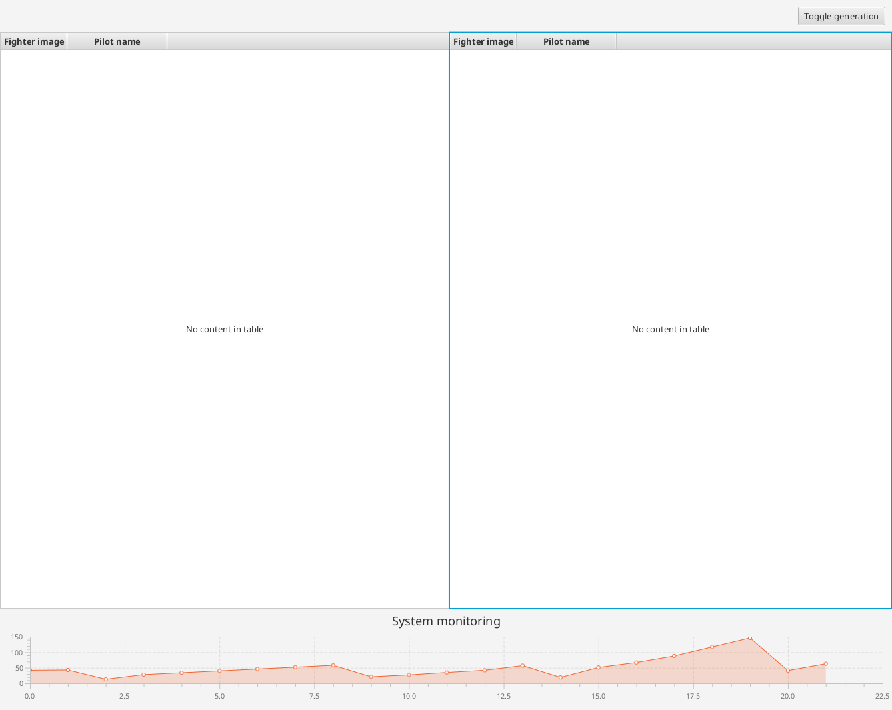

_This is an assignment to the [Software Architecture](https://ohm-softa.github.io) class at the [Technische Hochschule Nürnberg](http://www.th-nuernberg.de)._

# Assignment 9: Adapter and Flyweight

This assignment covers the two design patterns _Adapter_ and _Flyweight_.

At first you have to improve the performance by implementing the flyweight pattern.
After that you will implement an adapter to load the images with an API that is easier to handle.

## Setup

1. Create a fork of this repository (button in the right upper corner)
1. Clone the project (get the link by clicking the green _Clone or download button_)
1. Import the project to your Android Studio; it behaves almost the same as IntelliJ.

> Note: The project uses JavaFX which doesn't work in IntelliJ out of the box.
> Start the app manually using gradle in the terminal: `./gradlew run`

## `TableView<>` - Intro

The given app generates two random fleets of Star Wars fighters (one for the light side and one for the dark side of the force -- obviously).
The application displays the two fleets in two `TableView<>`s containing the following information:

* an image of the fighter type
* the name of the pilot

Up to now, every JavaFX application we implemented used to display the data with a `ListView<>` that actually just calls the `toString()` of the objects passed to it.
The usage of a `TableView<>` is a little bit more complicated and requires the implementation of _CellValueFactory_ (factory pattern!) to transport the data from an object instance to the `TableView<>`.
The implementation is located in the `de.thro.inf.prg3.a09.internals.displaying` package.

## Flyweight

If you click the **Start** button, a background thread will be started that creates `Fighter` instances as long as you don't stop the thread by click the button again.
To keep the load of the UI thread as low as possible, the background thread always creates a certain amount of `Fighter` instances before pushing them to the UI at once whenever the configured threshold (defaults to 10) is reached.

The area chart at the bottom of the window shows the amount of memory (in megabytes) allocated by the application updated every second by another background thread.

The background thread instantiated by the **Start/Stop** button handler is using a `FighterFactory` instance to create new fighters.
If you have a closer look at the implementation you will notice that there's an implemenation flaw the results in a huge amount of allocated memory the more `Fighter` instances you create.

Here comes the Flyweight pattern into play:

1. Think about what are the intrinsic and what are the extrinsic parts of the `Fighter` class.  (In case you don't remember the terms or the concept have a look [here](https://hsro-inf-prg3.github.io/09ln-proxy-adapter-flyweight/#flyweight).)
2. Refactor the class `FighterFactory` to follow the Flyweight pattern by caching the intrinsic parts.
3. Modify the process of creation to benefit of your caching mechanism.

_Hint: think of a data structure that enables you to retrieve the matching element with a single call?._

If everything works out the memory usage should stagnate instead of constantly grow when you start the application.

## Adapter

As you already know adapters are used e.g to create a compatibility layer between to incompatible interfaces or to create a more convenient API if the API of e.g. a library is too complicated.

You might have noticed that the API to load an image in the `FighterFactory` is a little bit more complicated and verbose than probably required.
As a good software engineer you should implement a `FxImageLoaderAdapter` that encapsulates the generic `ResourceLoader<T>` and that has a more convenient API shown in the following UML.

_Hint: the arrow between the two classes only illustrates a composition of the `FxImageLoaderAdapter` and the `ResourceLoader<T>`._
